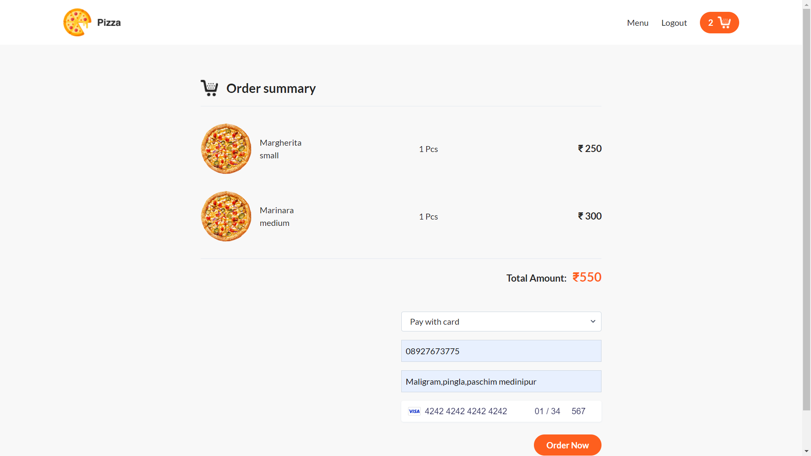

# Real-Time Pizza Tracker 🍕

A comprehensive real-time pizza delivery tracking system built with Node.js, Express, MongoDB, EJS, and Socket.IO. It features a customer and admin dashboard, order tracking, and real-time updates. The app also integrates Nodemailer for sending email notifications.

## Deployment on Render 🔥

1. **Push the project to GitHub**.
2. **deploy** https://sujoy-pizza.onrender.com


## Features ✨

- **Real-Time Order Tracking**: Track pizza delivery in real-time using Google Maps and Socket.IO.
- **Customer Dashboard**: Place orders, view order history, and track delivery status.
- **Admin Dashboard**: Manage orders, update status, and view order details.
- **Nodemailer Integration**: Send order confirmation and status update emails to customers.
- **User Authentication**: Secure login and registration for customers and admin.
- **Responsive Design**: Works seamlessly across devices.

## Tech Stack 🛠️

- **Frontend**: HTML, CSS, Bootstrap, EJS
- **Backend**: Node.js, Express, MongoDB, Socket.IO
- **Email**: Nodemailer
- **Deployment**: Vercel (Frontend), Render (Backend)

## Screenshots 📸

### Payment Dashboard


### Admin Panel


## Getting Started 🚀

### Prerequisites

- Node.js and npm installed
- MongoDB database

### Installation

1. **Clone the repository**:

    ```bash
    git clone https://github.com/sujoyghoshal/RealTime-Pizza-Tracker.git
    cd RealTime-Pizza-Tracker
    ```

2. **Install dependencies**:

    ```bash
    npm install
    ```

3. **Set up environment variables**:
   Create a `.env` file in the root directory and add your configuration:

    ```bash
    PORT=3000
    COOKIE_SECRET='Your secret KEY'
    MONGO_URI=<your_mongodb_connection_string>
    EMAIL_USER=<your_email_address>
    EMAIL_PASS=<your_email_password>
    GMAIL_USER=sujoyghoshal.s@gmail.com
    GMAIL_PASS=cxspuzwlfoebftuz
    ```

4. **Run the app**:

    ```bash
    npm start
    ```

5. **Access the application**:

    - Frontend: `http://localhost:3000`
    - Admin Panel: `http://localhost:3000/admin`

## Nodemailer Setup 📧

Nodemailer is used to send order confirmation and status updates to customers.

1. Install Nodemailer:

    ```bash
    npm install nodemailer
    ```

2. Configure Nodemailer in `mailer.js`:

    ```javascript
    const nodemailer = require('nodemailer');

    const transporter = nodemailer.createTransport({
      service: 'gmail',
      auth: {
        user: process.env.EMAIL_USER,
        pass: process.env.EMAIL_PASS
      }
    });

    module.exports = transporter;
    ```

3. Send email notifications:

    ```javascript
      const transporter = nodemailer.createTransport({
                service: "gmail",
                secure: true,
                port: 465,
                auth: {
                    user: process.env.GMAIL_USER,
                    pass: process.env.GMAIL_PASS
                }
            });

     const mailOptions = {
                from: process.env.GMAIL_USER,
                to: req.user.email,
                subject: "Order Confirmation",
                text: `Hello ${req.user.name}, your order has been confirmed! Order ID: ${order._id}` 
            };
    ```

## Contributing 🤝

Contributions, issues, and feature requests are welcome! Feel free to check [issues page](https://github.com/sujoyghoshal/RealTime-Pizza-Tracker/issues).

## License 📄

This project is licensed under the MIT License.

## Contact 📬

- **Author**: [Sujoy Ghoshal](https://github.com/sujoyghoshal)
- **Email**: sujoyghoshal.s@gmail.com
